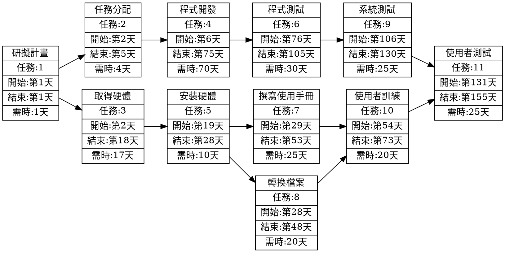
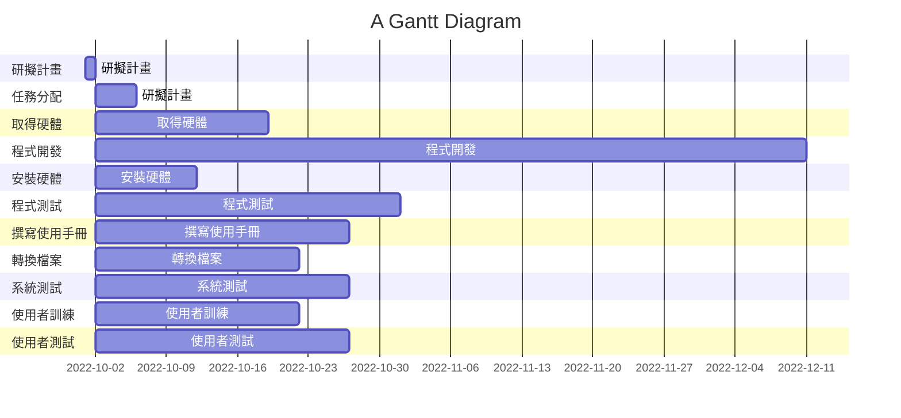

```graphviz
digraph {
	node[shape=record];
	rankdir="LR";
    no1 [label = "研擬計畫 | 任務:1 | 開始:第1天 | 結束:第1天 | 需時:1天"]
    no2 [label = "任務分配 | 任務:2 | 開始:第2天 | 結束:第5天 | 需時:4天"]
    no1->no2
    no3 [label = "取得硬體 | 任務:3 | 開始:第2天 | 結束:第18天 | 需時:17天"]
    no1->no3
    no4 [label = "程式開發 | 任務:4 | 開始:第6天 | 結束:第75天 | 需時:70天"]
    no2->no4
    no5 [label = "安裝硬體 | 任務:5 | 開始:第19天 | 結束:第28天 | 需時:10天"]
    no3->no5
    no6 [label = "程式測試 | 任務:6 | 開始:第76天 | 結束:第105天 | 需時:30天"]
    no4->no6
    no7 [label = "撰寫使用手冊 | 任務:7 | 開始:第29天 | 結束:第53天 | 需時:25天"]
    no5->no7
    no8 [label = "轉換檔案 | 任務:8 | 開始:第28天 | 結束:第48天 | 需時:20天"]
    no5->no8
    no9 [label = "系統測試 | 任務:9 | 開始:第106天 | 結束:第130天 | 需時:25天"]
    no6->no9
    no10 [label = "使用者訓練 | 任務:10 | 開始:第54天 | 結束:第73天 | 需時:20天"]
    no7,no8 ->no10
    no11 [label = "使用者測試 | 任務:11 | 開始:第131天 | 結束:第155天 | 需時:25天"]
    no9,no10->no11
}
```

### Mermaid

```mermaid
gantt
    title A Gantt Diagram

    section 研擬計畫 
    研擬計畫          :a1, 2022-10-01, 1d
    section 任務分配
    研擬計畫          :2022-10-02  , 4d
    section 取得硬體
    取得硬體          :2022-10-02  , 17d
    section 程式開發
    程式開發          :2022-10-02  , 70d
    section 安裝硬體
    安裝硬體         :2022-10-02  , 10d
    section 程式測試
    程式測試          :2022-10-02  , 30d
    section 撰寫使用手冊
    撰寫使用手冊          :2022-10-02  , 25d
    section 轉換檔案
    轉換檔案          :2022-10-02  , 20d
    section 系統測試
    系統測試          :2022-10-02  , 25d
    section 使用者訓練
    使用者訓練          :2022-10-02  , 20d
    section 使用者測試
    使用者測試         :2022-10-02  , 25d
  
```
